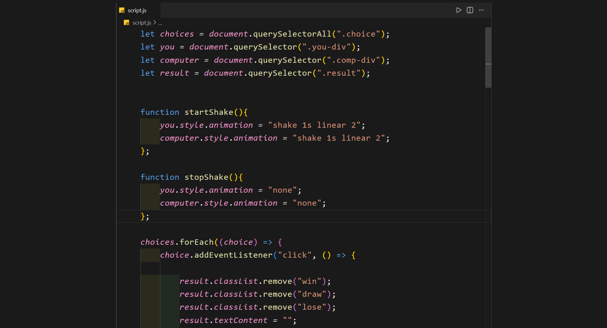
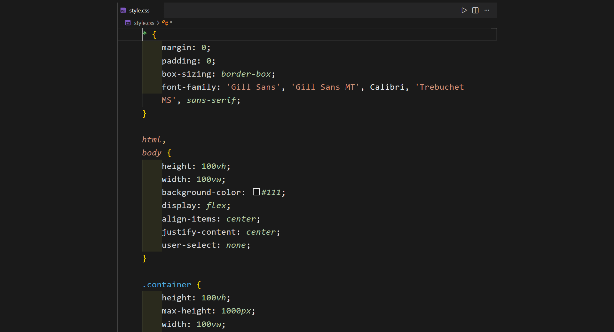
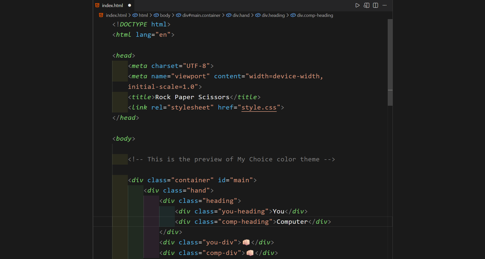

# My Choice Color Theme

A clean, modern, and eye-friendly dark color theme for Visual Studio Code.  
Designed for better readability, balanced contrast, and long coding sessions.

---

## ✨ Features

- Clean & minimal dark UI
- Eye-friendly color palette
- Clear syntax highlighting
- Better indentation visibility
- Optimized for long coding sessions
- Best suited for:
  - HTML
  - CSS
  - JavaScript

---

## 🖼️ Screenshots

### JavaScript Preview


### CSS Preview


### Html Preview


---

## ⚙️ Recommended Editor Settings (Optional)

For best visual experience, add this to your VS Code `settings.json`:

```json
{
  "editor.fontSize": 14,
  "editor.lineHeight": 22,
  "editor.cursorBlinking": "smooth",
  "editor.cursorSmoothCaretAnimation": "on",
  "editor.cursorWidth": 2,
  "editor.wordWrap": "on",
  "editor.smoothScrolling": true
}
```

---

## 📦 Installation
### Install from VS Code Marketplace

1. Open Visual Studio Code
2. Go to Extensions (Ctrl + Shift + X)
3. Search for My Choice Color Theme
4. Click Install
5. Press Ctrl + Shift + P
6. Select Preferences: Color Theme
7. Choose My Choice Color Theme

---

### 🔖 Version

v0.0.1

--- 

## 👤 Author

**Naitik Bansal**
